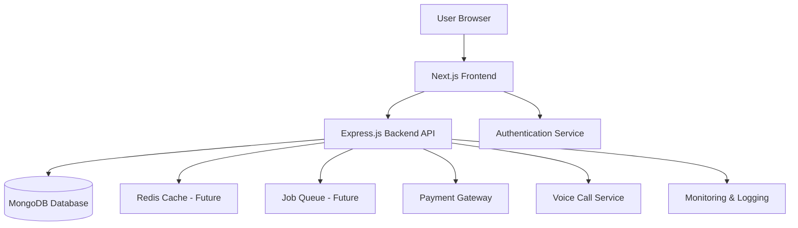
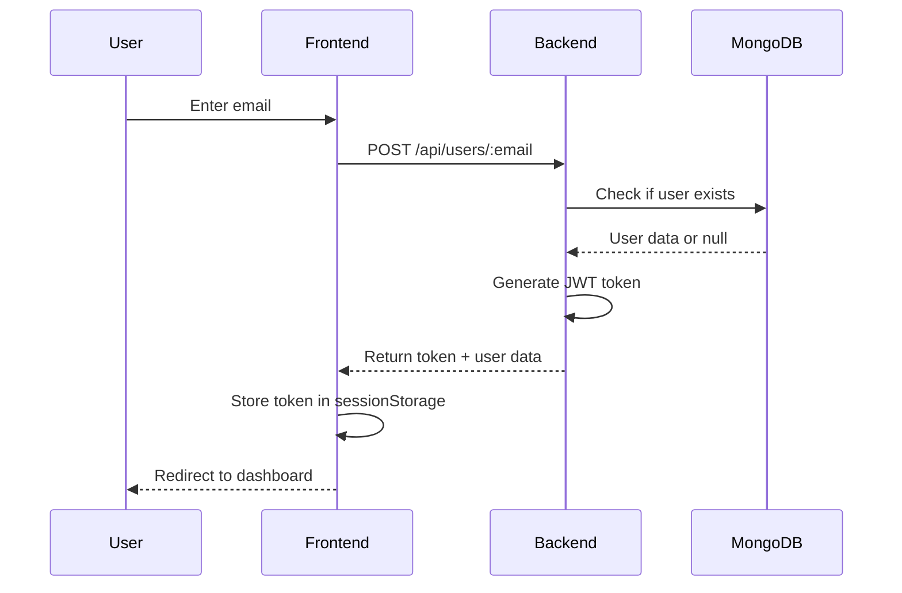
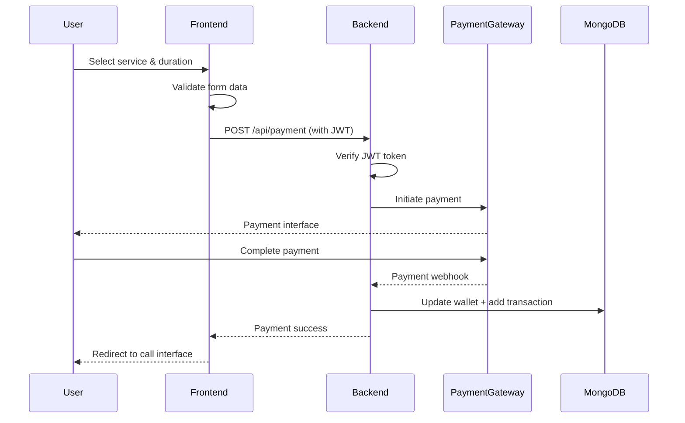

# StressReliefChat Architecture

## System Overview

StressReliefChat is a mental health support platform built with a modern, scalable architecture using Next.js for the frontend and Express.js for the backend, with MongoDB as the database.

## High-Level Architecture



## Technology Stack

### Frontend
- **Framework**: Next.js 14 (App Router)
- **Language**: TypeScript
- **Styling**: Tailwind CSS
- **State Management**: React Hooks + Session Storage
- **Form Validation**: Zod + React Hook Form
- **HTTP Client**: Fetch API
- **Error Handling**: Error Boundaries + Custom Error Handler

### Backend
- **Runtime**: Node.js 18+
- **Framework**: Express.js
- **Language**: JavaScript (with plans for TypeScript migration)
- **Database**: MongoDB with Mongoose-like patterns
- **Authentication**: JWT (JSON Web Tokens)
- **Logging**: Winston with file rotation
- **Security**: Helmet.js, express-rate-limit, express-validator

### Infrastructure
- **Containerization**: Docker + Docker Compose
- **CI/CD**: GitHub Actions
- **Monitoring**: Winston logs + Health check endpoints
- **Reverse Proxy**: Nginx (production)
- **Process Manager**: PM2 (production)

## Application Structure

### Frontend Structure

```
frontend/
├── app/                    # Next.js app directory
│   ├── api/               # API routes (Next.js API routes)
│   ├── dashboard/         # Dashboard page
│   ├── call-interface/    # Call interface page
│   ├── emergency/         # Emergency support page
│   ├── globals.css        # Global styles
│   ├── layout.tsx         # Root layout
│   └── page.tsx           # Landing page
├── components/            # Reusable React components
│   ├── AITriage.tsx
│   ├── CallOptionCard.tsx
│   ├── EmergencyModal.tsx
│   ├── PaymentSection.tsx
│   ├── ErrorBoundary.tsx
│   ├── LoadingSpinner.tsx
│   └── LoadingSkeleton.tsx
├── lib/                   # Utility functions
│   ├── data.ts           # Dummy data
│   ├── storage.ts        # Storage helpers
│   ├── validationSchemas.ts
│   └── errorHandler.ts
├── hooks/                 # Custom React hooks
│   └── useApi.ts
└── types/                 # TypeScript type definitions
```

### Backend Structure

```
backend/
├── config/               # Configuration files
│   ├── database.js      # MongoDB connection
│   └── indexes.js       # Database indexes
├── controllers/         # Request handlers
│   ├── userController.js
│   ├── walletController.js
│   ├── transactionController.js
│   ├── favoriteController.js
│   └── previousCallsController.js
├── middleware/          # Express middleware
│   ├── cors.js
│   ├── auth.js
│   ├── rateLimiter.js
│   ├── validator.js
│   ├── requestLogger.js
│   └── errorHandler.js
├── routes/              # API routes
│   ├── userRoutes.js
│   └── healthRoutes.js
├── utils/               # Utility functions
│   ├── logger.js
│   └── AppError.js
├── logs/                # Application logs
└── server.js            # Application entry point
```

## Data Flow

### User Authentication Flow



### Payment Flow



## Database Schema

### Users Collection

```javascript
{
  _id: ObjectId,
  email: String (unique),
  name: String,
  phone: String,
  walletBalance: Number (default: 0),
  createdAt: Date,
  updatedAt: Date
}
```

**Indexes:**
- `email` (unique)
- `phone` (sparse)
- `createdAt` (descending)

### Transactions Collection

```javascript
{
  _id: ObjectId,
  email: String,
  amount: Number,
  type: String (payment, refund, wallet_credit, wallet_debit),
  description: String,
  metadata: Object,
  createdAt: Date
}
```

**Indexes:**
- `email + createdAt` (compound)
- `type`
- `createdAt` (descending)

### Favorites Collection

```javascript
{
  _id: ObjectId,
  email: String (unique),
  favorites: Array[String],
  updatedAt: Date
}
```

**Indexes:**
- `email` (unique)

## Security Architecture

### Security Layers

1. **Transport Security**
   - HTTPS/TLS in production
   - Secure WebSocket connections
   - HSTS headers

2. **Application Security**
   - Helmet.js security headers
   - CORS configuration
   - Rate limiting
   - Input validation and sanitization
   - JWT token authentication

3. **Data Security**
   - MongoDB connection encryption
   - Sensitive data not logged
   - Environment variable protection

4. **API Security**
   - JWT authentication for protected routes
   - Token expiration
   - Rate limiting per IP and endpoint type
   - Request validation

## Scalability Considerations

### Current Architecture
- Single backend instance
- MongoDB Atlas (managed, scalable)
- Session-based state management on frontend

### Future Scaling Options

1. **Horizontal Scaling**
   - Load balancer (Nginx/HAProxy)
   - Multiple backend instances
   - Sticky sessions or stateless authentication

2. **Caching Layer**
   - Redis for session storage
   - Cache frequently accessed user data
   - Cache listener/therapist profiles

3. **Database Optimization**
   - Read replicas for MongoDB
   - Sharding for high data volumes
   - Query optimization with indexes

4. **CDN Integration**
   - Serve static assets from CDN
   - Geo-distributed content delivery

5. **Microservices** (If needed at scale)
   - Payment service
   - Voice call service
   - User service
   - Notification service

## Monitoring & Observability

### Logging
- **Winston** for structured logging
- Log levels: error, warn, info, http, debug
- Daily log rotation
- Separate error logs

### Health Checks
- `/health` - Basic liveness probe
- `/health/detailed` - Readiness probe with DB status
- `/health/ready` - Kubernetes readiness
- `/health/live` - Kubernetes liveness

### Metrics (Future)
- Request count and duration
- Error rates
- Database query performance
- Memory and CPU usage

### Error Tracking (Future)
- Sentry integration ready
- Frontend error boundaries
- Backend error logging

## Performance Optimizations

### Frontend
- Next.js automatic code splitting
- Image optimization
- Lazy loading components
- Caching strategies

### Backend
- Database connection pooling
- MongoDB indexes for fast queries
- Rate limiting to prevent abuse
- Gzip compression

### Database
- Compound indexes for common queries
- TTL indexes for temporary data
- Query optimization

## Future Enhancements

1. **Real-time Communication**
   - WebSocket integration for live calls
   - Real-time chat support

2. **Queue System**
   - Bull/BullMQ for background jobs
   - Email notifications
   - Scheduled tasks

3. **Analytics**
   - User behavior tracking
   - Conversion funnel analysis
   - A/B testing framework

4. **Mobile Apps**
   - React Native mobile applications
   - Shared API backend

5. **AI Integration**
   - Voice AI for initial triage
   - Sentiment analysis
   - Automated matching algorithms
